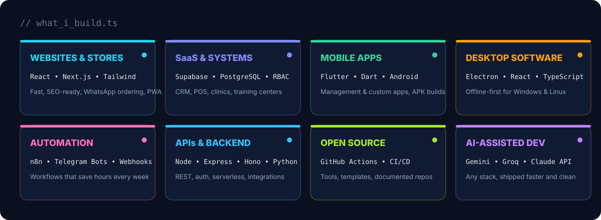

 

  

---

### 👋 About

I'm **Mohamed Ghanem**, a Full-Stack Developer & Software Engineer from Egypt. I turn business needs into software people actually use: **management systems, online stores, SaaS products, mobile and desktop apps, bots and automation**. I ship a project almost every day, and I use AI tooling to pick up any language or stack fast, while keeping full control over architecture and code quality.

<b>🇪🇬 نبذة بالعربي</b>

أنا **محمد غانم**، مطور Full-Stack ومهندس برمجيات من مصر. بحوّل احتياج الشغل لبرنامج حقيقي بيتستخدم: **مواقع ومتاجر إلكترونية، منصات SaaS، سيستمات إدارة، تطبيقات موبايل (Flutter / Android)، برامج ديسكتوب للويندوز ولينكس، بوتات تيليجرام وأتمتة n8n، وAPIs**. بشتغل على المشاريع المفتوحة المصدر وبرفع مشروع جديد باستمرار، وبستخدم الذكاء الاصطناعي عشان أتعلم وأنفّذ بأي لغة أو تقنية بسرعة وبجودة احترافية.

للتواصل: mohamedghanemfs99@gmail.com

---

### 🧩 What I build

---

### 🛠️ Tech arsenal

<b>Frontend</b> 
  
<b>Backend &amp; Databases</b> 
  
<b>Mobile &amp; Desktop</b> 
  
<b>DevOps &amp; Cloud</b> 
  

---

### 🚀 Featured projects

<!-- EDIT: replace the repo names/links below with your 6 best repos, then pin the same 6 on your profile -->
| Project | What it does | Stack |
|---|---|---|
| [**TurboStore**](https://github.com/mohamedghanem-dev/TurboStore) | High-performance online store, offline-capable PWA, WhatsApp ordering | React · PWA |
| [**Edu-CRM**](https://github.com/mohamedghanem-dev/Edu-CRM) | Training-center management with role-based access and dashboards | Supabase · PostgreSQL |
| [**Clinic System**](https://github.com/mohamedghanem-dev/) | Clinic management: patients, bookings, reports | Full-stack |
| [**Windows Desktop Suite**](https://github.com/mohamedghanem-dev/) | Offline business apps (POS, centers, installments) packaged as EXE | Electron · TypeScript |

### 🕒 Latest projects (auto-updated daily)

<!--RECENT:START-->
| Project | What it is | Stack | Updated |
|---|---|---|---|
| _will fill itself after the first workflow run_ | | | |
<!--RECENT:END-->

---

### 📊 Live stats

 

<picture>
  <source media="(prefers-color-scheme: dark)" srcset="https://raw.githubusercontent.com/mohamedghanem-dev/mohamedghanem-dev/output/snake-dark.svg"/>
  
</picture>

---

### 💬 Have a project in mind?

**Website · Store · SaaS · Mobile app · Desktop software · Bot · Automation**

<!-- Add when ready:

-->

⭐ If something here helped you, a star on the repo is the best thank-you.

